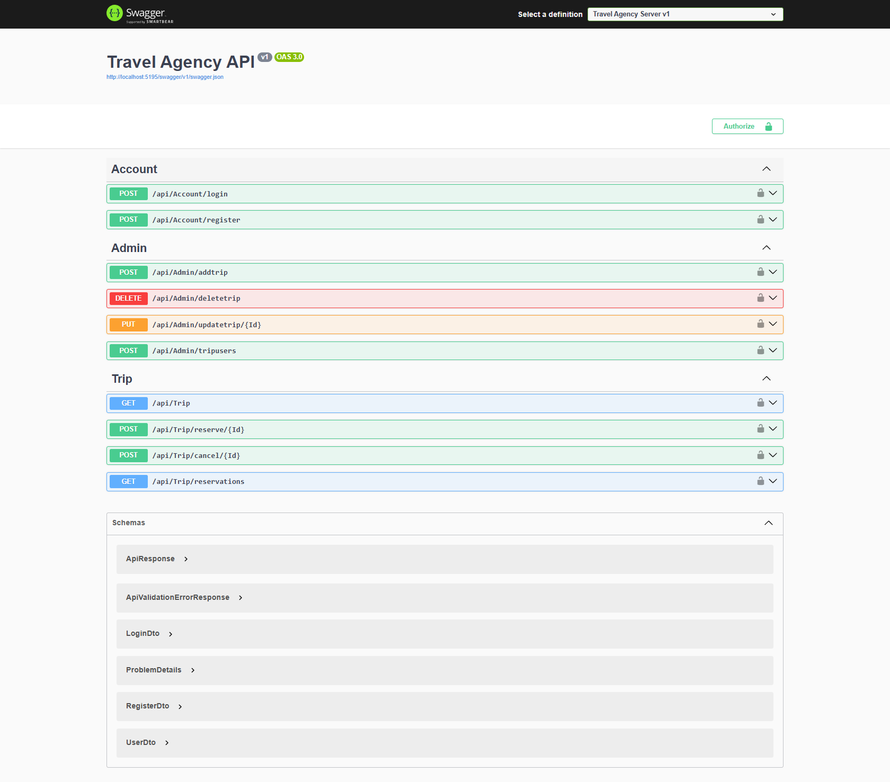

# Travel Agency Server

This is the backend server for the Travel Agency platform, responsible for handling business logic, database interactions, and API endpoints. Built with **Node.js**, **Express.js**, and **MongoDB**, it provides a secure and efficient backend for managing trips, reservations, and users.

## Features

### Customer Features

- 🌍 View and fetch trip details via API.
- 🎫 Book trips and manage reservations.
- ❌ Cancel trip reservations.
- 📄 View all personal reservations.

### Admin Features

- ➕ Add new trips with details and images.
- ✏️ Edit or delete existing trips.
- 📅 View all reservations for each trip.
- 🔒 Secure authentication and authorization for admins.

## 🛠 Tech Stack

- **.NET 9** – Backend framework.
- **Entity Framework Core** – ORM for database interactions.
- **SQL Server** – Relational database for storing trips, users, and reservations.
- **JWT** – Secure authentication and authorization.

## 🚀 Installation

1. **Clone the repository:**

   ```sh
   git clone https://github.com/Kareem-Mohamed-Wardany/Travel-Agency-Server-DotNet.git
   ```

2. **Navigate to the project folder:**

   ```sh
   cd Travel-Agency-Server-DotNet
   ```

3. **Set up environment variables:**
   use `appsettings.Development.json` file and configure the required credentials:

   ```env
    "ConnectionStrings": {
    "DB": "YOUR_CONNECTION_STRING"
   },
   "JWT": {
    "AuthKey": "",
    "ValidAudiance": "",
    "ValidIssuer": "",
    "DurationInDays": 30
   },
   "ApiBaseUrl": ""
   ```

4. **Run database migrations:**

   ```sh
   dotnet ef database update
   ```

5. **Run database migrations:**

   ```sh
    dotnet run
   ```

6. **API Endpoints:**
   

## 🤝 Contributions

Feel free to contribute by submitting pull requests or reporting issues.
